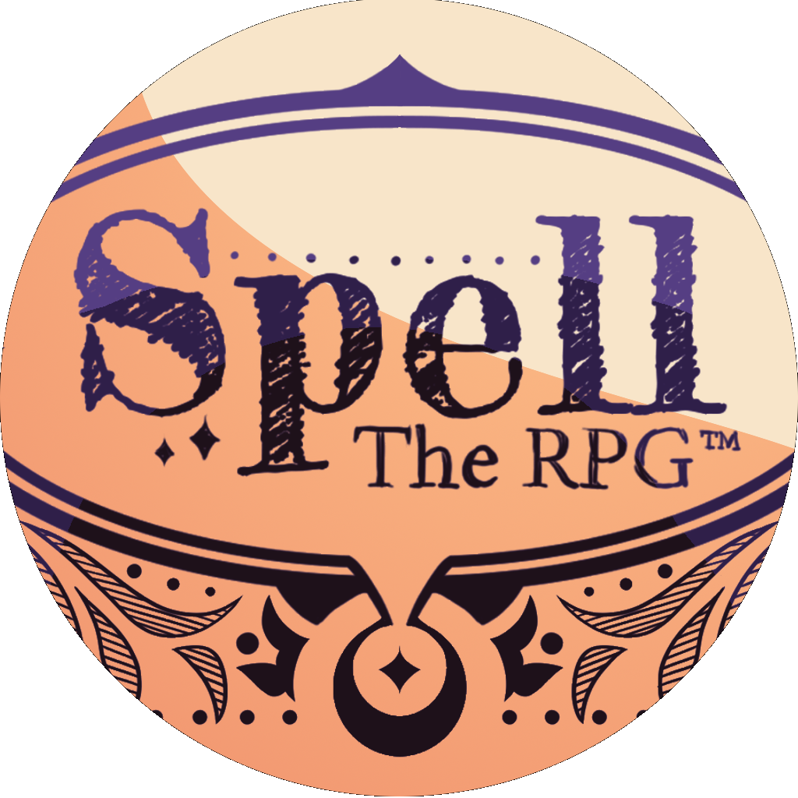

<p align="center">
  
</p>

# Spell Bot
**Spell Bot** is a Discord bot for playing [__**Spell: the RPG**__](https://whimsymachinegames.com/2019/08/29/spell-the-rpg/) from Whimsy Machine Games.

## Usage
To invite this bot to your Discord server, [click here](https://discord.com/api/oauth2/authorize?client_id=736909104848568410&permissions=2048&scope=bot).

### Commands


#### Draw

To draw letter tiles send one of the following messages:
```
/spell draw <# of tiles>
```
 or
```
/spell draw <# of dice>d6
```
#### Help

To see a help message:
```
/spell help
```
<p align="center">
  
</p>

## License
Copyright (c) 2020, Sergio Rodriguez. (MIT License)

See [LICENSE](LICENSE) for more info.
